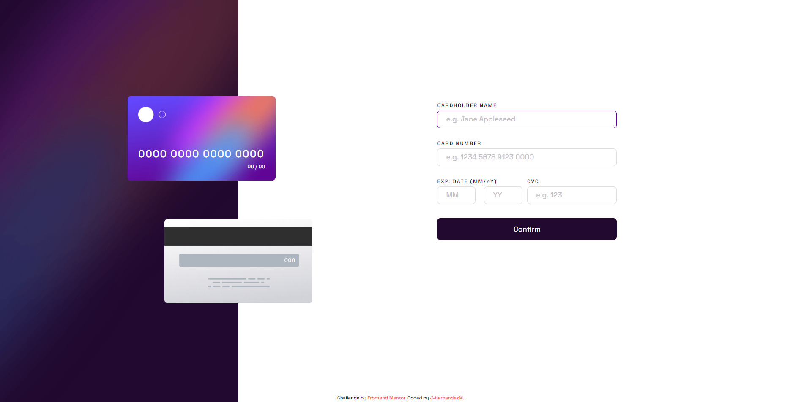

# Frontend Mentor - Interactive card details form solution

Esta es mi propuesta de solucion al reto [Interactive card details form challenge on Frontend Mentor](https://www.frontendmentor.io/challenges/interactive-card-details-form-XpS8cKZDWw).

- [Descripcion](#descripcion)
  - [El desafio](#el-desafio)
  - [Screenshot](#screenshot)
  - [Links](#links)
- [Mi proceso](#mi-proceso)
  - [Hecho con](#hecho-con)
  - [Lo aprendido](#lo-que-aprendi)
  - [Aprendiendo](#aprendiendo)
- [Autor](#autor)

## Descripcion
Componente interactivo tipo formulario para llenar una tarjeta. Dinamicamente los numeros se disponen en los componentes ilustrativos, teniendo dos pantallas y pudiendo reiniciarlo.

## El desafio

El usuario deberia poder

- Llenar el formulario y ver como se actualizan los datos en tiempo real.
- Recibir un mensaje de error si:
  - Cualquier input esta vacio.
  - Cualquiera de los campos esta en el formato inadecuado
- Ver el layout optimo dependiendo de su tamano de pantalla.
- Ver la interaccion cuando se coloca el mouse encima de los elementos.

## Screenshot

## Links

- Solucion: [GITHUB](https://github.com/J-HernandezM/card-interactive-details/)
- Live site: [PAGES](https://j-hernandezm.github.io/card-interactive-details/)

## Mi proceso

Para este ejercicio lo que mas se me complico fueron los estilos CSS, en general el layout, colores y demas se me hace sencillo, pero lo que se me complica mas es la interaccion entre los diferentes componentes, que no se salgan de sus contenedores, que no se superpongan, etc.

En cuanto al JavaScript me senti mas habil en ese aspecto, pienso que lo logre solucionar en un mejor tiempo y sin mayores complicaciones.\

Cosas que me presentaron problema. Los espacios entre los numeros de la tarjeta, tuve que usar manejo de arrays y una pequena formula para lograrlo. Otro feature que me costo un poco fue cortar el input del usuario para que no coloque mas de cierto numero de caracteres en el input

Establecer los pattern en el input fue un tanto complicado para hacerlos funcionar.

## Hecho con

- Semantic HTML5 markup
- CSS custom properties
- Flexbox
- CSS Grid
- Mobile-first workflow
- simple JavaScript

## Lo que aprendi

Aprendi a modificar una background image en CSS segun mis necesidades.

Manejar correctamente arrays pasandolos a strings o viceversa.

Reforce mis conocimientos para cambiar los estilos de errores desde JavaScript

## Aprendiendo
Me gustaria mejorar mi habilidad para hacer layouts, sobretodo la parte de CSS es la que mas se me esta complicando

Me gustaria en los siguientes proyectos seguir aplicando JavaScript asi sea basico para no olvidar las cositas que he aprendido.

## Author

- Website - [Add your name here](https://www.your-site.com)
- Frontend Mentor - [@yourusername](https://www.frontendmentor.io/profile/yourusername)
- Twitter - [@yourusername](https://www.twitter.com/yourusername)

**Note: Delete this note and add/remove/edit lines above based on what links you'd like to share.**

## Autor

- Website - [Portfolio en construccion](https://j-hernandezm.github.io)
- Frontend Mentor - [@J-HernandezM](https://www.frontendmentor.io/profile/J-HernandezM)
- Github - [@J-HernandezM](https://github.com/J-HernandezM)
- Twitter - [@__HernandezM](https://www.twitter.com/__HernandezM)

